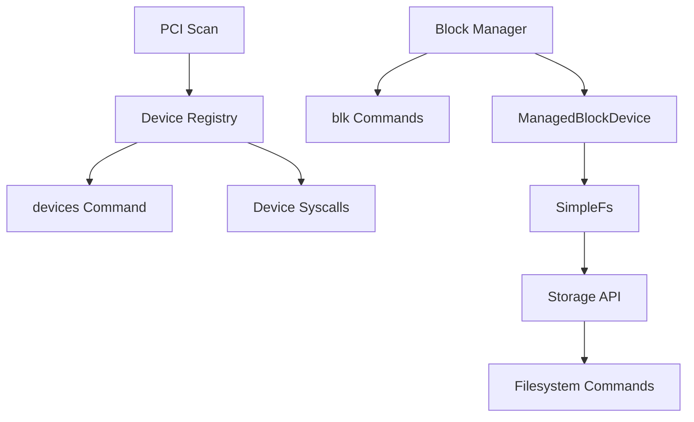

# Device Design (Phase 8)

AresOS Phase 8 introduces a small device layer and block-device manager. The goal is to prove driver registration, discovery, block backend selection, and filesystem mounting through a managed device path before implementing full AHCI, NVMe, or virtio-blk drivers.

## Layers



## Device Registry

The registry in `kernel/src/device.rs` tracks:

- device id
- name
- kind
- state
- optional PCI vendor/device/class/subclass
- optional PCI bus/slot/function location

The PCI scanner performs conservative config-space reads and registers discovered devices. If no PCI devices are visible, it records an empty-scan sentinel instead of panicking.

## Block Manager

The block manager in `kernel/src/block.rs` tracks block backends independently from the filesystem:

- block id
- backend kind
- sector size
- sector count
- readonly flag
- driver-backed flag

Phase 8 ships with `qemu-sim-block0`, a simulated QEMU-style driver-backed block backend. It uses the same sector read/write path as a future hardware driver, while keeping validation deterministic.

## Storage Integration

`kernel/src/storage.rs` now mounts `SimpleFs` through `ManagedBlockDevice`, which delegates sector I/O to the active block backend. The Phase 7 `MemoryBlockDevice` remains available for focused filesystem tests.

The kernel emits:

```text
Phase8-Devices: total=..., pci=..., block=..., block_devices=..., driver_backed=..., storage_backend=..., storage_ok=true
```

## Shell Commands

- `devices`
- `blk list`
- `blk info <id>`
- `mount <block-id>`
- existing filesystem commands: `ls`, `cat`, `touch`, `write`, `rm`, `mount`, `format`, `fsinfo`

## Validation

```bash
python scripts/phase8_device_check.py --timeout 20
python scripts/validation_matrix.py --soak-duration 20 --latency-duration 20
```

## Deferred Work

- Production AHCI/NVMe/virtio-blk drivers
- DMA and interrupt-driven block I/O
- MSI/MSI-X setup
- Driver binding based on PCI BARs and capabilities
- Raw ELF/binary loading from storage
