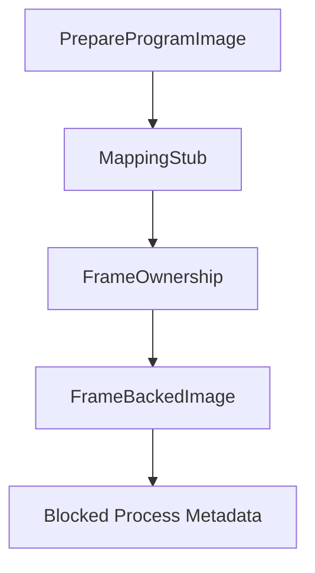

# Frame-Backed Images

Phase 15 converts Phase 13 mapped-image stubs into frame-backed image records. These records consume owned frames from the Phase 14 frame ownership service and attach them to the mapped executable pages. Phase 16 uses these records to build inactive user page-table descriptors.

## Backed Image Contents

A `FrameBackedImage` records:

- source image name and path
- mapping id and address-space id
- backed regions and pages
- owned frame records for each mapped page
- copied and zero-filled byte counts
- page permission counts
- owner credentials
- `MappingState::FrameBacked`

The copy and zero-fill operations are still accounting records. They are associated with owned backing frames, but Phase 15 does not install those frames into process page tables or execute from them.

## Loader Flow



The loader exposes `back_mapped_program(credentials, name)`. It prepares the image, creates a mapping stub, consumes owned frames for each mapped page, records a blocked `FrameBacked` process record, and updates status counters.

## Shell And Smoke

The shell exposes:

- `bin back <program>`
- `bin plans`
- `frames`

Boot emits:

```text
Phase15-FrameBackedImage: backed=..., rejected=..., pages=..., frame_allocated=..., copied=..., zeroed=..., smoke_ok=true
```

## Safety Boundary

`run hello` remains unsupported in Phase 15. Frame-backed records are the data needed by later page-table work, not executable user mappings. Phase 16 adds descriptor translation, but still does not switch CR3.
