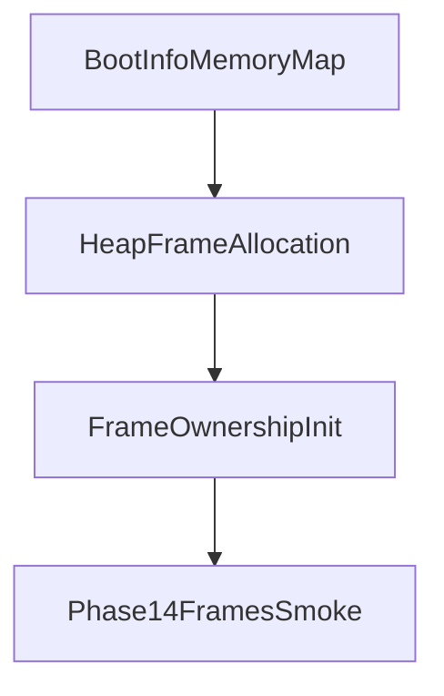

# Frame Ownership

Phase 14 introduces a persistent frame ownership service. It records a bounded pool of usable physical frame addresses from the bootloader memory map after the kernel heap has consumed its boot-time frames.

## What It Tracks

The frame ownership registry records:

- tracked frame token
- physical frame start address
- current owner
- available and allocated frame counts
- allocation, release, and failed-allocation counters

Owners are intentionally simple in this phase: kernel, image, page-table, and test. Later phases can use these records to back executable images and inactive user page tables.

## Boot Flow



Phase 14 skips frames already consumed by heap initialization and tracks a bounded subset of remaining usable frames. It does not replace the boot allocator or install user page-table mappings.

## Shell And Syscalls

The shell exposes:

- `frames`

Syscalls expose tracked, available, allocated, allocation, release, and failed-allocation counts.

Boot emits:

```text
Phase14-Frames: initialized=..., tracked=..., available=..., allocated=..., allocations=..., releases=..., failures=..., smoke_ok=true
```

## Safety Boundary

Phase 14 is ownership bookkeeping. Phase 13 mapping stubs still use deterministic frame tokens and do not consume real owned frames. Real backing frames for executable images are deferred to Phase 15.
