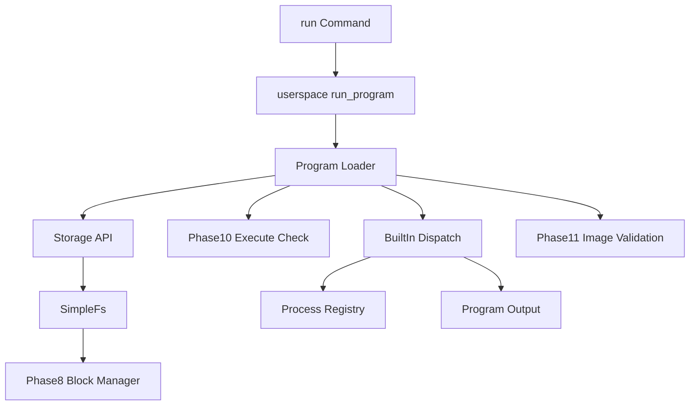

# Program Loader Design (Phases 9-11)

AresOS Phase 9 introduces stored program records. Programs are discovered from `/bin/*` files in the Phase 7 filesystem mounted through the Phase 8 block manager.

Phase 9 did not execute raw machine code. Instead, each stored program was a small manifest that mapped a filesystem record to a known built-in entry target. Phase 11 extends that contract with discoverable ELF64 image records that can be validated but not executed yet.

## Manifest Format

```text
ares-exec-v1
name=echo
kind=builtin-alias
entry=echo
description=Print arguments
requires=execute
trust=system
owner=admin
```

Required fields:

- `name`
- `kind=builtin-alias`
- `entry`

Optional fields:

- `description`
- `requires=execute`
- `trust=system` or `trust=user`
- `owner`

Image programs use:

```text
ares-exec-v1
name=hello
kind=elf64-image
entry=0x400000
image=/bin/hello.elf
requires=execute
trust=user
owner=user
description=ELF image validation fixture
```

## Loader Flow



## Shell Commands

- `run <program> [args...]`
- `programs`
- `bin list`
- `bin info <program>`
- `bin validate <program>`

## Runtime Observability

The kernel emits:

```text
Phase9-Loader: programs=..., launch_ok=true, storage_backed=true, launches=..., failed_launches=...
```

Loader status is also available through syscall/status helpers:

- program count
- launch count
- failed launch count
- denied launch count
- image count
- valid image count
- invalid image count
- unsupported execution count

Phase 11 also emits:

```text
Phase11-Images: images=..., valid=..., rejected=..., exec_blocked_ok=true
```

## Validation

```bash
python scripts/phase9_loader_check.py --timeout 20
python scripts/validation_matrix.py --soak-duration 20 --latency-duration 20
```

## Deferred Work

- ELF relocation
- Loading raw binary code into executable mapped memory
- User/kernel privilege separation for executable code
- Demand paging and memory-mapped executable files
- Program signatures
