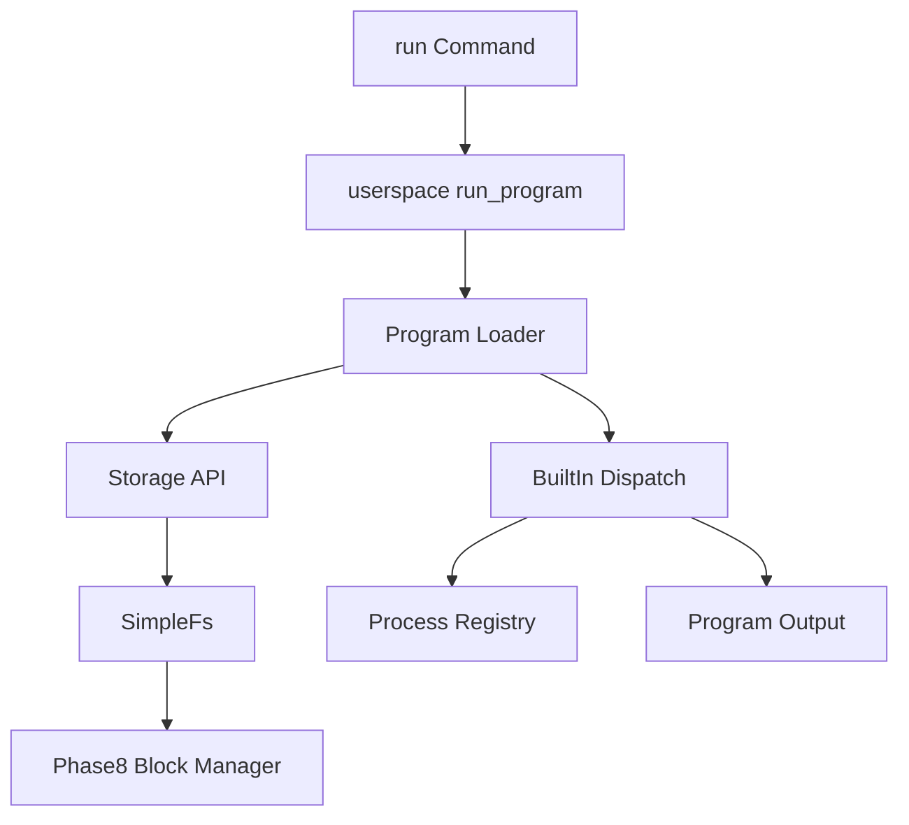

# Program Loader Design (Phase 9)

AresOS Phase 9 introduces stored program records. Programs are discovered from `/bin/*` files in the Phase 7 filesystem mounted through the Phase 8 block manager.

This phase does not execute raw machine code. Instead, each stored program is a small manifest that maps a filesystem record to a known built-in entry target. That gives AresOS a stable loader contract before adding ELF parsing, relocation, paging isolation, or executable memory management.

## Manifest Format

```text
ares-exec-v1
name=echo
kind=builtin-alias
entry=echo
description=Print arguments
```

Required fields:

- `name`
- `kind=builtin-alias`
- `entry`

Optional fields:

- `description`

## Loader Flow



## Shell Commands

- `run <program> [args...]`
- `programs`
- `bin list`
- `bin info <program>`

## Runtime Observability

The kernel emits:

```text
Phase9-Loader: programs=..., launch_ok=true, storage_backed=true, launches=..., failed_launches=...
```

Loader status is also available through syscall/status helpers:

- program count
- launch count
- failed launch count

## Validation

```bash
python scripts/phase9_loader_check.py --timeout 20
python scripts/validation_matrix.py --soak-duration 20 --latency-duration 20
```

## Deferred Work

- ELF parsing and relocation
- Loading raw binary code into separate address spaces
- User/kernel privilege separation for executable code
- Demand paging and memory-mapped executable files
- Program signatures, permissions, and ownership
