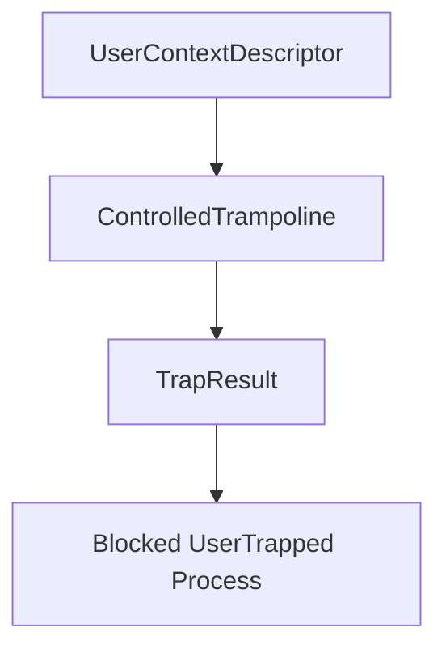

# Controlled Ring 3 Trampoline

Phase 18 adds a controlled trampoline result path for user-entry validation. It records that a prepared user context entered the controlled path and trapped back through the reserved user trap vector. Phase 19 builds on this with user syscall return metadata.

## Trampoline Result

A `Ring3TrampolineResult` records:

- entry RIP
- user RSP
- trap vector
- trap reason
- whether the controlled path entered
- whether it trapped back

The user trap vector is `0x80`.

## Loader Flow



The loader exposes `enter_controlled_ring3_trampoline(credentials, name)`. It prepares the user context, records controlled entry/trap counters, and adds blocked process metadata.

## Shell And Smoke

The shell exposes:

- `bin ring3 <program>`
- `bin plans`

Boot emits:

```text
Phase18-Ring3: entries=..., traps=..., rejected=..., trap_vector=128, survived=true
```

## Safety Boundary

Phase 18 validates the controlled trampoline path and trap metadata. It does not run arbitrary ELF code. Phase 19 exposes a syscall return ABI for a controlled probe, but still does not execute arbitrary ELF syscall instructions.
