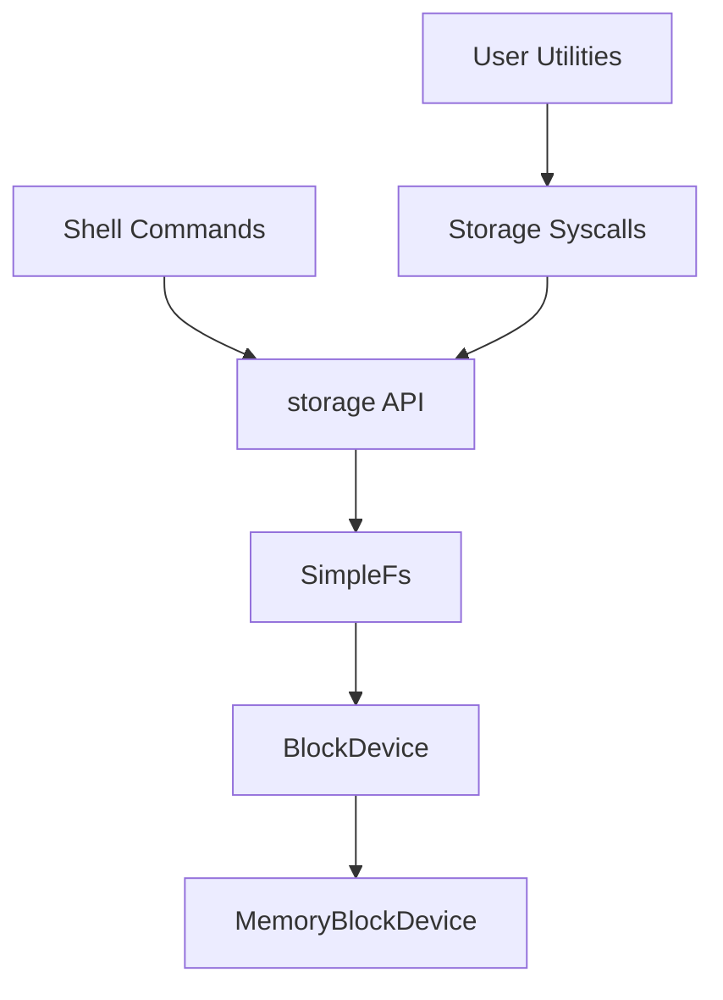

# Storage Design (Phase 7)

AresOS Phase 7 introduces a small persistent storage stack on top of a block-device boundary. The implementation intentionally uses an in-memory block device first, so filesystem semantics can stabilize before real disk hardware drivers are added.

## Layers



## Filesystem Format

- Sector size: 512 bytes
- Header sector: magic, version, file count
- Directory table: fixed-size entries
- File data: one sector per file
- Maximum files: 16
- Maximum file size: 512 bytes
- Maximum path length: 48 bytes

Each write updates file data and flushes the directory/header metadata to the backing block device. Remount validation proves data survives unmount/mount cycles on the same device instance.

## Runtime API

Primary kernel APIs live in `kernel/src/storage.rs`:

- `init()`
- `format()`
- `remount()`
- `list_files()`
- `read_file(path)`
- `create_file(path)`
- `write_file(path, contents)`
- `delete_file(path)`
- `info()`
- `phase7_smoke_check()`

## Shell Commands

- `ls`
- `cat <path>`
- `touch <path>`
- `write <path> <text>`
- `rm <path>`
- `mount`
- `format`
- `fsinfo`

## Validation

```bash
python scripts/phase7_storage_check.py --timeout 20
python scripts/validation_matrix.py --soak-duration 20 --latency-duration 20
```

The kernel emits:

```text
Phase7-Storage: mounted=true, persistent_rw_ok=true
```

## Deferred Work

- Real AHCI/NVMe/virtio block drivers
- FAT/ext-style filesystem compatibility
- Journaling and crash consistency
- File permissions and ownership
- Loading executable program images from storage
