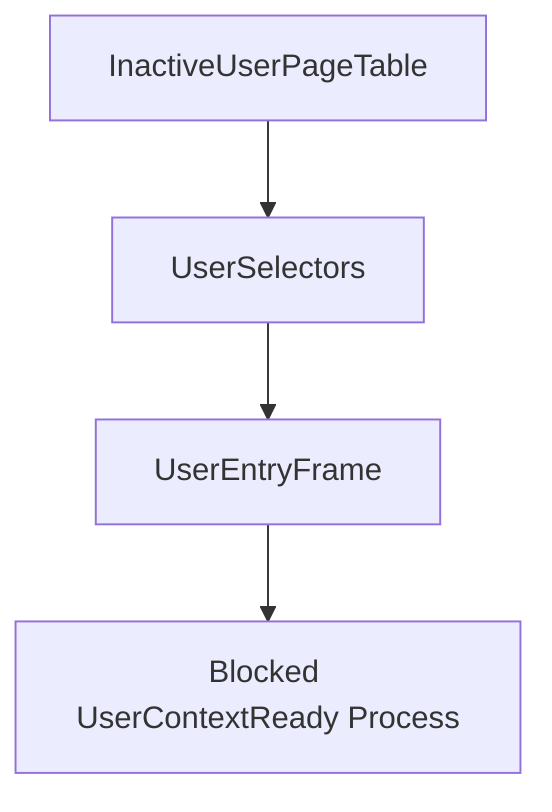

# User Context Groundwork

Phase 17 prepares descriptor-level user entry contexts. It adds user segment selectors and builds an iret-style frame for a validated image entry point, but it does not enter Ring 3.

## Context Contents

A `UserContextDescriptor` records:

- inactive user page-table id
- user RIP
- user RSP
- RFLAGS
- user code selector
- user stack/data selector
- user stack descriptor
- selector and entry readiness flags
- whether Ring 3 was entered

`ring3_entered` remains false in Phase 17.

## Loader Flow



The loader exposes `prepare_user_context(credentials, name)`. It builds the earlier page-table descriptors, validates the entry point translation, constructs the user entry frame, records process metadata, and updates counters.

## Shell And Smoke

The shell exposes:

- `bin userctx <program>`
- `bin plans`

Boot emits:

```text
Phase17-UserContext: contexts=..., rejected=..., user_code=..., user_data=..., entry_ok=true, ring3_entered=false
```

## Safety Boundary

Phase 17 prepares the data needed for a future transition. It does not execute `iretq`, switch CR3, enter Ring 3, or jump to ELF code.
