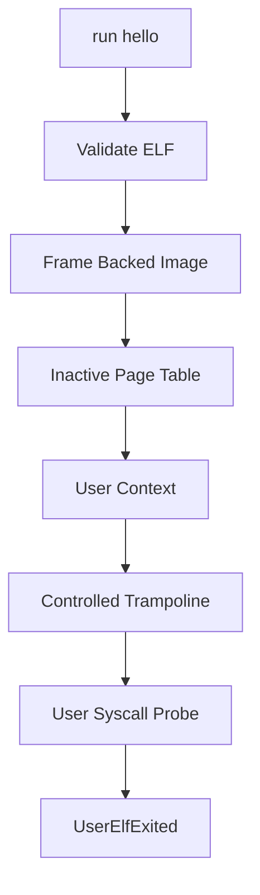

# Minimal User ELF MVP

Phase 20 enables the seeded `/bin/hello` ELF path to complete through the guarded user execution pipeline. It is intentionally narrow: only the known hello image is accepted, and it returns deterministic kernel-recorded output and exit status.

## Execution Flow



The loader exposes `execute_minimal_user_elf(credentials, "hello")`. It records a successful guarded execution and returns:

```text
hello: exit=0 tick=<tick-count>
```

## Shell And Smoke

The existing command now succeeds:

```text
run hello
```

Boot emits:

```text
Phase20-UserElf: executions=..., exits=..., rejected=..., hello_ok=true
```

## Safety Boundary

Phase 20 is a minimal MVP for the seeded hello image. It does not support arbitrary ELF execution, dynamic linking, relocation, demand paging, or broad process isolation.
