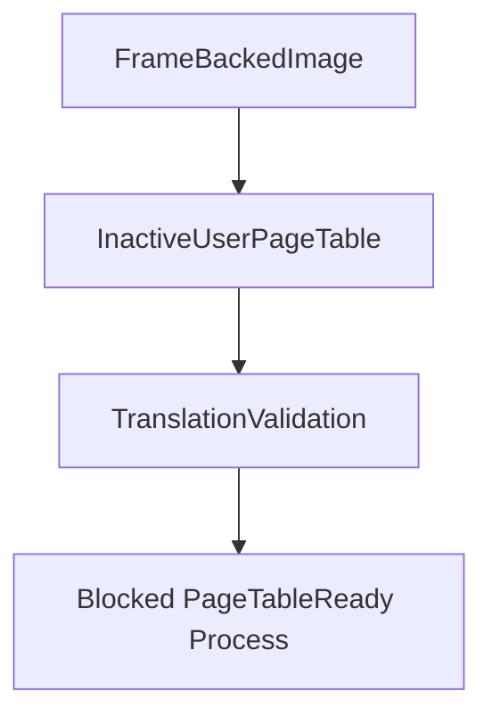

# Inactive User Page Tables

Phase 16 builds inactive user page-table descriptors from Phase 15 frame-backed images. These descriptors model the virtual-to-physical mappings a future CR3 switch would use, but they do not switch CR3 or execute user code.

## Table Contents

An `InactiveUserPageTable` records:

- page-table id
- address-space id
- user virtual page mappings
- owned frame tokens and physical frame addresses
- load permissions
- executable, writable, and read-only page counts
- whether required kernel mappings are shared
- whether the table is ready for CR3 switching

Phase 16 keeps `cr3_switch_ready=false`; later phases will add entry and switch mechanics.

## Loader Flow



The loader exposes `build_user_page_table(credentials, name)`. It prepares, maps, frame-backs, and then describes the inactive page table for the image.

## Shell And Smoke

The shell exposes:

- `bin pagetable <program>`
- `bin plans`

Boot emits:

```text
Phase16-PageTables: tables=..., rejected=..., pages=..., translate_ok=true, cr3_switched=false
```

## Safety Boundary

Phase 16 validates translation through descriptor lookup only. It does not install hardware page tables, switch CR3, enter Ring 3, or execute ELF code.
