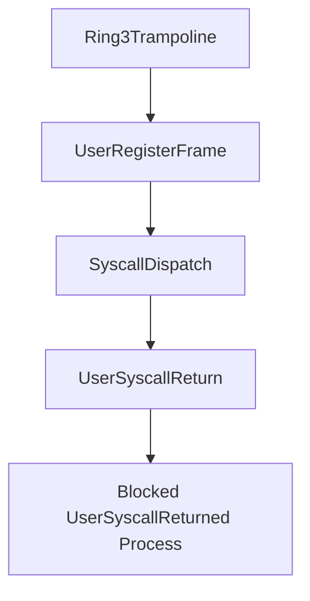

# User Syscall Return ABI

Phase 19 adds a user-facing syscall register-frame ABI. It preserves the existing `invoke_raw` dispatcher and wraps it with user entry and return metadata.

## ABI Records

A `UserRegisterFrame` records:

- syscall id
- first argument
- return value
- optional error

A `UserSyscallReturn` records the same fields plus whether control returned to the user context.

## Loader Flow



The loader exposes `run_user_syscall_probe(credentials, name)`. It prepares the controlled user path and dispatches a tick-count syscall probe through the user ABI.

## Shell And Smoke

The shell exposes:

- `bin usyscall <program>`
- `bin plans`

Boot emits:

```text
Phase19-SyscallReturn: syscalls=..., returns=..., rejected=..., abi_ok=true, returned_ok=true
```

## Safety Boundary

Phase 19 validates syscall entry/return metadata. It does not yet execute CPU `syscall`/`sysret` instructions or run arbitrary ELF syscall instructions.
